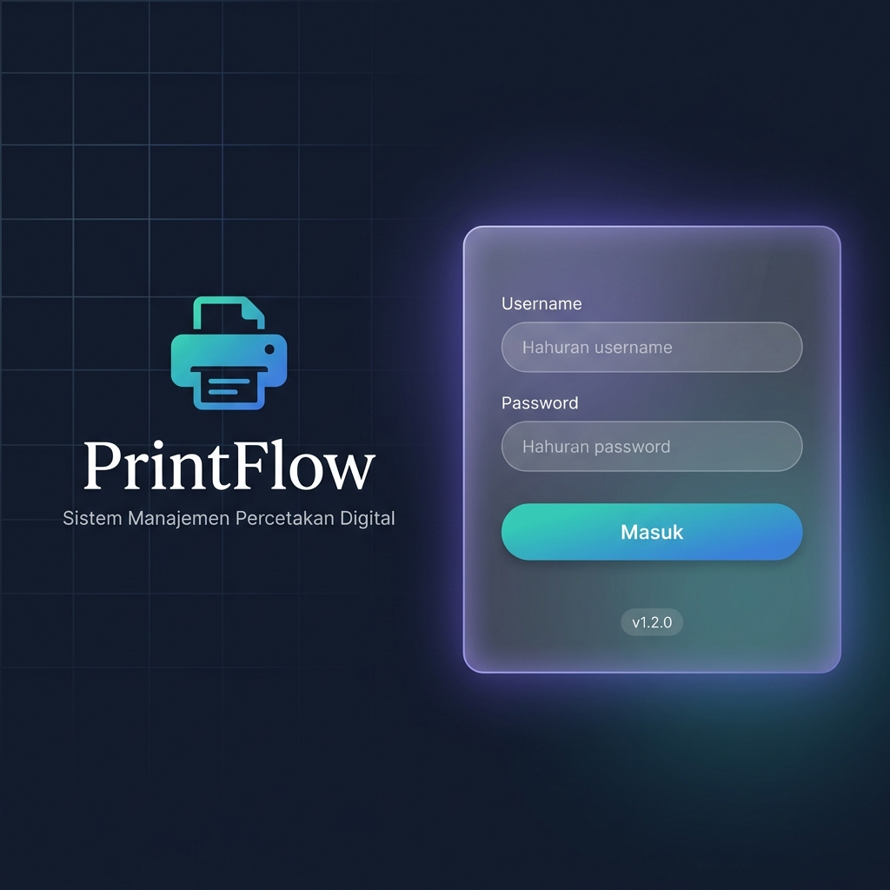
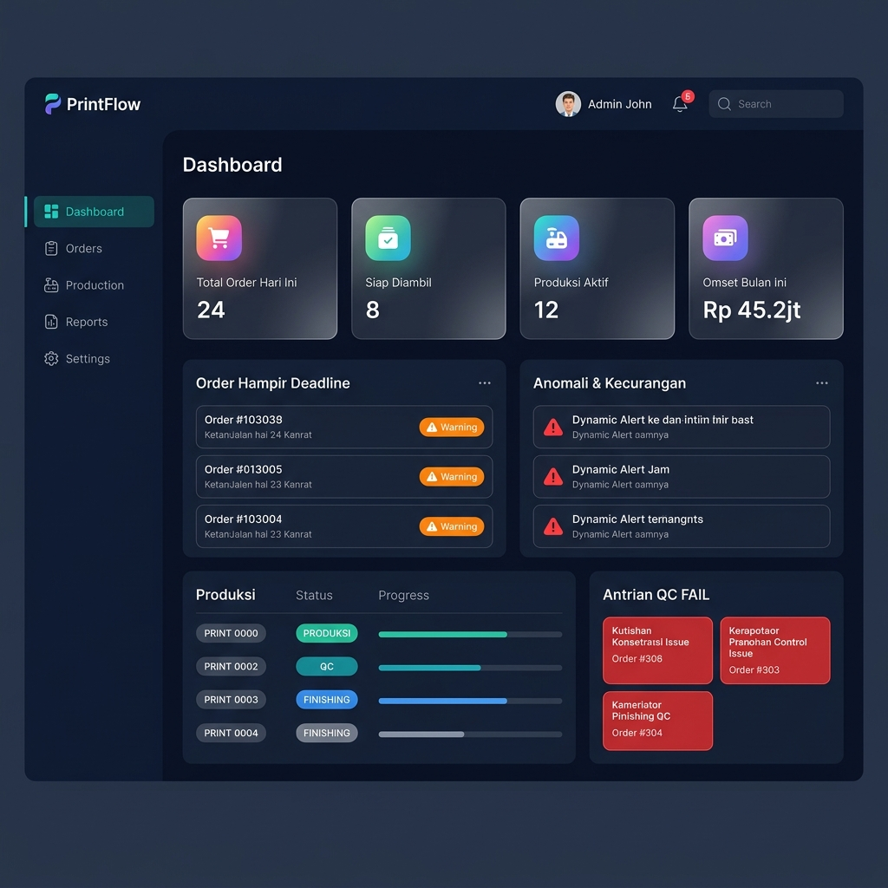
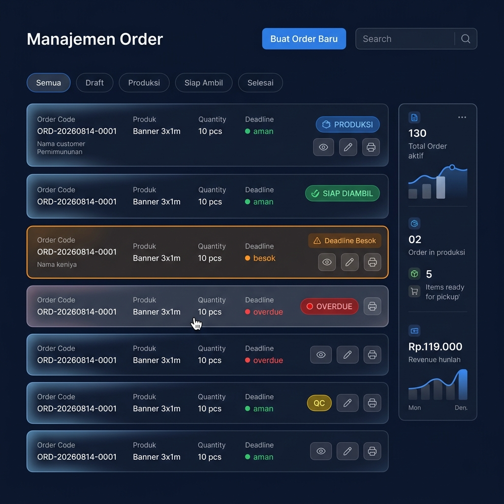
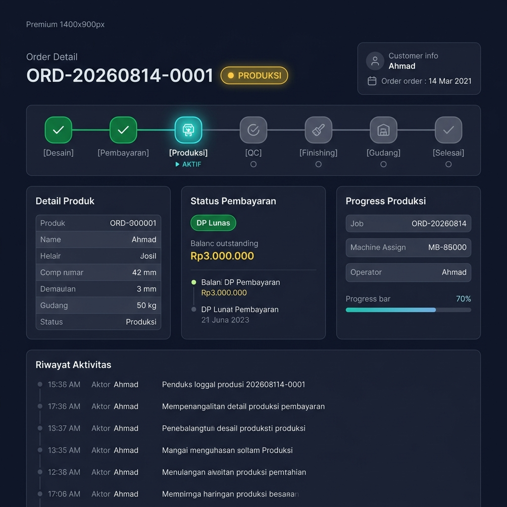
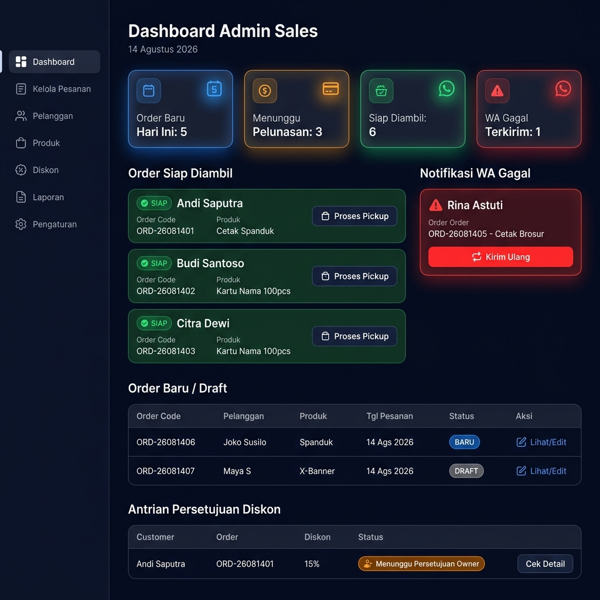
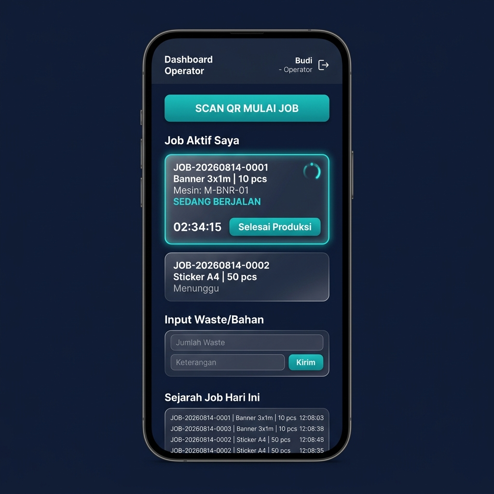
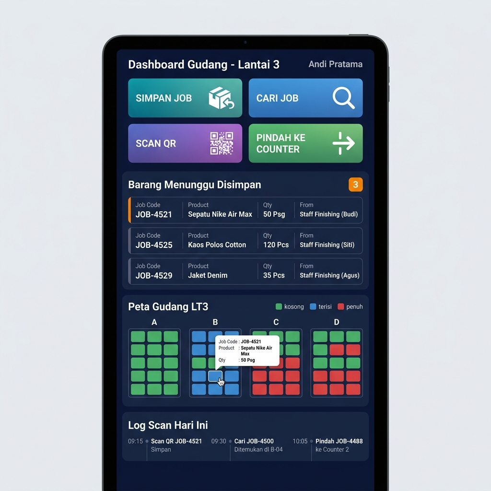
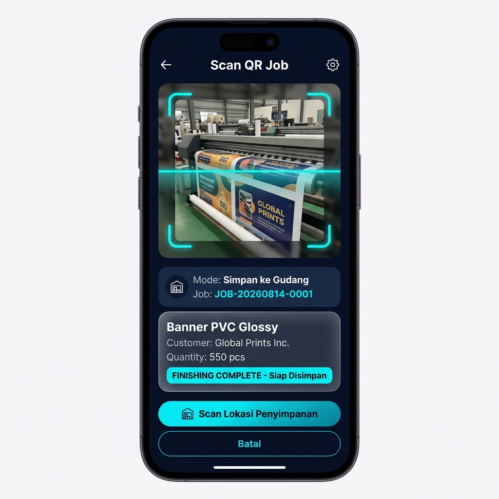

# 🎨 UI/UX Mockups — Print Pilot
> Semua file gambar ada di folder ini: `08-UI-UX/MOCKUPS/`

---

## 01 — Halaman Login

**Konsep:** Split screen. Kiri: logo + tagline di background off-white lembut. Kanan: card putih flat dengan form login, tombol "Masuk" gradient teal. Sesuai tema light mode "Paper Studio Light" — bukan lagi dark mode/glassmorphism (gambar mockup ini adalah referensi versi lama, perlu diperbarui menyesuaikan tema saat ini).

---

## 02 — Owner Dashboard

**Elemen:** 4 KPI card (Total Order, Siap Diambil, Produksi Aktif, Omset), panel Order Hampir Deadline, panel Anomali & Kecurangan, pipeline produksi, antrian QC FAIL merah.

---

## 03 — Manajemen Order

**Elemen:** Filter chip (Semua/Draft/Produksi/Siap Ambil/Selesai), baris OVERDUE merah, baris Deadline Besok kuning, status pills per baris, mini stats panel kanan.

---

## 04 — Detail Order & Workflow Stepper

**Elemen:** Stepper 7 langkah (Desain→Pembayaran→Produksi→QC→Finishing→Gudang→Selesai), 3 panel info (Detail Produk, Status Pembayaran, Progress Produksi), riwayat aktivitas dengan timestamp.

---

## 05 — Admin Dashboard

**Elemen:** Order Siap Diambil (hijau, tombol Proses Pickup), Notifikasi WA Gagal (merah, tombol Kirim Ulang), Order Baru/Draft tabel, Antrian Persetujuan Diskon (menunggu Owner).

---

## 06 — Operator Dashboard (Mobile)

**Elemen:** Tombol besar "SCAN QR MULAI JOB", job aktif dengan timer (02:34:15), tombol Selesai Produksi, antrian job berikutnya, form input waste.

---

## 07 — Gudang Dashboard, Tab Storage (Tablet)

> Ini salah satu dari 3 tab di dashboard role **Gudang** (QC / Finishing / Storage) — lihat `GUDANG-DASHBOARD.md`.

**Elemen:** 4 tombol besar (SIMPAN JOB / CARI JOB / SCAN QR / PINDAH KE COUNTER), daftar barang menunggu disimpan, peta gudang visual per zona (hijau=kosong, biru=terisi, merah=penuh), popup info saat klik slot.

---

## 08 — Scan QR (HP / Mobile Browser)

**Elemen:** Kamera aktif dengan bracket sudut teal, garis scan bergerak, info mode scan, hasil scan muncul sebagai card (nama produk, qty, status), tombol besar "Scan Lokasi Penyimpanan" dan "Batal".

---

## Catatan untuk Tim Frontend

- Semua gambar di atas adalah referensi desain — bukan final pixel-perfect
- Warna, ukuran, dan layout mengacu ke `DESIGN-SYSTEM.md` di folder yang sama
- Gambar bisa dibuka langsung dari folder `MOCKUPS/` untuk zoom in detail
- Jika ada perubahan desain, buat versi baru di folder yang sama dengan nama `XX-NAMA-v2.png`
