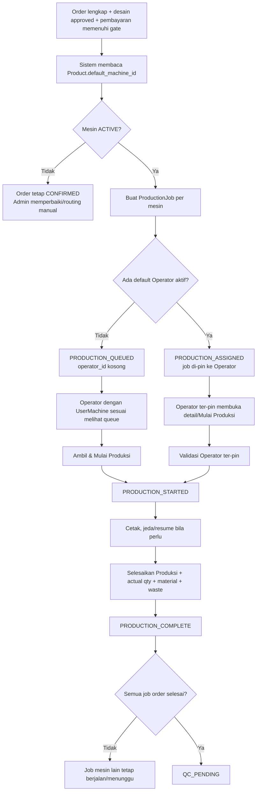

# Laporan Audit Multi-Operator dan Multi-Mesin

**Tanggal audit:** 15 September 2026  
**Ruang lingkup:** routing order ke mesin, pembagian job ke banyak Operator, pengambilan job antrean, assignment manual, pergantian Operator/mesin, dan pengendalian akses.  
**Sumber:** `02-WORKFLOW/05-PRODUCTION.md`, `02-WORKFLOW/17-AUTO-RELEASE-PRODUKSI.md`, `03-ROLES/OPERATOR.md`, `frontend/src/lib/auto-release.ts`, `frontend/src/actions/queries.ts`, `frontend/src/actions/production.ts`, `frontend/src/actions/master-data.ts`, dan dashboard Operator.

## Kesimpulan eksekutif

Solusi yang paling tepat untuk Print Pilot adalah **routing otomatis oleh sistem dengan queue per mesin dan self-claim oleh Operator**, ditambah assignment manual Admin sebagai pengecualian. Operator mengambil **ProductionJob**, bukan mengambil seluruh order secara bebas.

Kerangka ini sudah tersedia di implementasi:

- Produk memiliki mesin default.
- Order yang lolos Completeness Gate dibuat menjadi ProductionJob.
- Item dengan mesin default yang sama saat ini digabung menjadi satu job per mesin.
- Job tanpa Operator masuk `PRODUCTION_QUEUED`.
- Job dengan default Operator aktif di-pin sebagai `PRODUCTION_ASSIGNED`.
- Operator hanya melihat job miliknya dan job antrean pada mesin yang diberikan melalui `UserMachine`.
- **Ambil & Mulai Produksi** (kode internal SCAN 1) melakukan claim secara atomik sehingga dua Operator tidak dapat memenangkan job yang sama.

Model ini cocok untuk tenant kecil sampai besar karena satu orang dapat diberi akses ke beberapa mesin, sementara satu mesin dapat memiliki beberapa Operator. Yang belum tersedia adalah penyeimbangan beban otomatis berdasarkan kapasitas, shift, dan jumlah job aktif.

## Alur operasional yang diaudit

## Bagaimana sistem membagi pekerjaan

### 1. Pembagian berdasarkan mesin

Mesin ditentukan dari `Product.default_machine_id`. Jika satu order memiliki item untuk Mesin A dan Mesin B, sistem membuat dua ProductionJob. Jika beberapa item memakai mesin yang sama, implementasi menggabungkannya menjadi satu job dan menjumlahkan `planned_qty`; deadline job memakai deadline paling awal dari item tersebut.

Konsekuensinya, kartu Operator harus selalu menampilkan daftar item, ukuran, bahan, finishing, jumlah, serta file approved yang relevan ke mesin job. Jangan mengandalkan satu nama produk atau satu jumlah ringkas karena satu job dapat mewakili beberapa item.

### 2. Pembagian berdasarkan Operator

- **Default Operator aktif:** job langsung berstatus `PRODUCTION_ASSIGNED` dan hanya Operator tersebut yang dapat memulai.
- **Tidak ada default Operator:** job berstatus `PRODUCTION_QUEUED`; Operator yang memiliki grant mesin tersebut dapat mengambilnya melalui **Ambil & Mulai Produksi**.
- **Satu Operator untuk beberapa mesin:** semua queue dari mesin yang tercantum pada `UserMachine` tampil di dashboard Operator itu.
- **Beberapa Operator untuk satu mesin:** mereka melihat queue mesin yang sama dan bersaing secara aman untuk claim; hanya claim pertama yang berhasil.
- **Operator tanpa grant mesin:** job mesin tersebut tidak tampil dan pengambilan job ditolak.

### 3. Urutan queue

Queue saat ini diurutkan berdasarkan prioritas deadline, deadline, lalu waktu pembuatan. Ini memberi dasar FIFO yang wajar, tetapi belum mempertimbangkan estimasi durasi, kemampuan Operator, status shift, atau beban job aktif.

## Aturan “ambil kerjaan” yang profesional

1. Sistem membuat ProductionJob setelah gate produksi lulus; tidak ada pekerjaan resmi tanpa Job ID.
2. Operator membuka **Antrian Masuk**, memeriksa mesin, spesifikasi, jumlah, bahan, finishing, deadline, dan file desain approved.
3. Operator menekan **Ambil & Mulai Produksi** atau memindai QR Job.
4. Sistem mengunci claim secara atomik. Jika Operator lain lebih dahulu mengambil, Operator kedua mendapat pesan bahwa job sudah diklaim.
5. Setelah claim, Operator menjadi penanggung jawab job. Operator lain tidak boleh memulai job yang sudah ter-pin atau sudah berjalan.
6. Operator boleh memiliki beberapa job aktif sesuai kebijakan saat ini, tetapi tiap job harus memiliki timer dan audit log sendiri.
7. Saat selesai, Operator mengisi actual quantity, reprint, waste dan alasannya, serta pemakaian material. Job berubah menjadi `PRODUCTION_COMPLETE`.
8. Order baru bergerak ke QC setelah seluruh ProductionJob pada order selesai.

Admin tetap memiliki jalur override untuk memilih mesin/operator, menangani rush order, mesin rusak, atau queue yang tidak memiliki Operator. Reassignment wajib memiliki alasan dan tercatat di audit log. Dokumen menetapkan maksimal dua reassignment per Job ID dalam 24 jam untuk Admin; percobaan berikutnya memerlukan keputusan Owner.

## Skenario yang harus didukung

| Skenario | Perilaku yang diharapkan |
|---|---|
| 1 mesin, 3 Operator | Semua Operator dengan grant mesin melihat queue; satu claim menang secara atomik. |
| 3 mesin, 1 Operator | Operator melihat queue ketiga mesin; Admin perlu mengatur prioritas dan kapasitas agar tidak overload. |
| 3 mesin, 10 Operator | Setiap Operator hanya melihat mesin yang diberikan; distribusi terjadi melalui queue per mesin. |
| Mesin tanpa Operator | Job tetap queued tetapi harus muncul sebagai alert Admin “mesin belum memiliki Operator”. |
| Default Operator cuti/nonaktif | Job tidak boleh dipin ke akun nonaktif; job harus kembali ke queue atau direassign Admin. |
| Mesin maintenance | Auto-release ditahan; Admin memilih mesin aktif yang kompatibel dan mencatat alasan. |
| Order multi-mesin | Satu job per mesin; status dan progress harus ditampilkan per job agar order-level `PRODUCTION_ASSIGNED` tidak menyesatkan. |
| Operator memantau banyak mesin | Diizinkan oleh implementasi, tetapi laporan durasi harus memperhitungkan overlap job. |
| File bermasalah sebelum mulai | Operator memakai jalur bounce; semua job pra-mulai order dihapus dan desain dikembalikan ke revisi. |
| File bermasalah setelah mulai | Tidak boleh mengganti file diam-diam; gunakan QC/rework dan simpan material yang sudah terpakai. |

## Kontrol yang sudah baik

- Routing mesin berasal dari master data produk, sehingga keputusan tidak dibuat manual oleh Operator.
- `UserMachine` membatasi queue berdasarkan mesin yang memang ditugaskan.
- Claim queue memakai conditional update atomik.
- Job yang di-pin hanya dapat dimulai Operator yang dipilih.
- Mesin nonaktif ditahan dari auto-release.
- Reassignment memiliki alasan, batas frekuensi, dan audit log.
- Job selesai baru mengurangi stok material dan menyimpan actual quantity/waste.
- Dashboard memberi peringatan bila Operator belum memiliki akses mesin.

## Temuan audit dan risiko

### P1 — Query queue belum memiliki role guard server-side

`getOperatorJobs()` memeriksa tenant dan `UserMachine`, tetapi tidak memanggil guard permission Operator sebelum membaca data. Jika role lain memperoleh machine grant, action ini dapat mengembalikan data queue walaupun halaman normal tidak menampilkannya.

**Rekomendasi:** tambahkan pemeriksaan `can(actor, "production.execute")` atau permission read khusus Operator di awal action. Sediakan query terpisah untuk Admin/Owner.

### P1 — Reassignment belum memvalidasi target sebagai Operator aktif

`reassignProductionJob()` memastikan user berada di tenant, tetapi validasi role Operator aktif perlu ditegakkan kembali di action tersebut. Validasi UI atau form tidak cukup sebagai batas keamanan.

**Rekomendasi:** validasi role utama/`extra_roles`, `active = true`, tenant yang sama, dan grant mesin target dalam transaksi. Jika Admin memang memerlukan override, buat alasan override dan audit event khusus.

### P2 — Belum ada load balancing dan kapasitas mesin

Sistem memilih berdasarkan deadline dan waktu pembuatan. Ia belum menghitung kapasitas mesin, estimasi durasi, shift, maintenance window, atau jumlah job aktif per Operator. Operator yang diberi banyak mesin dapat mengambil terlalu banyak job.

**Rekomendasi bertahap:** tambahkan kapasitas harian/shift per mesin, estimasi durasi per produk, indikator beban per Operator, dan batas opsional job aktif yang dapat dikonfigurasi tenant. Default tetap fleksibel untuk percetakan kecil.

### P2 — Mesin tanpa grant tidak cukup terlihat oleh Admin

Job `PRODUCTION_QUEUED` hanya tampil pada Operator dengan grant mesin. Jika tidak ada seorang pun yang memiliki grant, job seolah-olah hilang dari sisi Operator.

**Rekomendasi:** dashboard Admin menampilkan panel “Queue tanpa Operator” dengan mesin, jumlah job, deadline terdekat, dan tombol “Atur Operator” atau “Reassign”. Kirim notifikasi saat job memasuki kondisi ini.

### P2 — Granularitas dokumen berbeda dari implementasi

Dokumen lama menyebut satu ProductionJob per item, sedangkan kode saat ini membuat satu job per mesin dan menggabungkan item dengan mesin sama.

**Rekomendasi:** tetapkan “satu ProductionJob per mesin” sebagai aturan resmi, ubah dokumen/UI, dan tampilkan mapping item → job. Jika nanti diperlukan pelacakan sangat rinci per item, buat child task tanpa mengubah job mesin utama.

### P2 — Status order-level dapat terlihat maju terlalu cepat

Saat satu job multi-mesin mulai, order dapat berubah menjadi `PRODUCTION_STARTED` meskipun job mesin lain masih queued. Ini valid sebagai status “produksi sudah dimulai”, tetapi mudah disalahartikan sebagai semua item sedang dicetak.

**Rekomendasi:** tampilkan progress agregat, misalnya `1/2 job dimulai`, `1/2 selesai`, dan status tiap mesin. Pertahankan status order untuk filter, gunakan progress sebagai sumber kebenaran operasional.

### P2 — Default Operator perlu dipantau terhadap grant mesin

Default Operator divalidasi sebagai user aktif ber-role Operator saat master mesin disimpan. Tetap perlu pemeriksaan berkala bahwa ia masih aktif dan memiliki `UserMachine` grant untuk mesin tersebut; data lama atau penghapusan grant dapat membuat assignment tidak sesuai.

## Rekomendasi desain operasional

Gunakan tiga lapisan tanggung jawab:

1. **Sistem:** readiness gate, routing mesin, prioritas deadline, pembuatan job, atomic claim, dan status.
2. **Operator:** memilih job dari queue mesinnya, memverifikasi spesifikasi/file, menjalankan produksi, dan mengisi hasil aktual.
3. **Admin/Owner:** mengatur mesin dan grant, menangani queue tanpa Operator, override assignment, dan memonitor anomali.

Untuk tenant kecil, satu Owner atau Admin dapat sekaligus menjadi Operator dengan menambahkan peran Operator dan grant mesin. Untuk tenant besar, pisahkan supervisor yang mengatur assignment dari Operator yang mengeksekusi pekerjaan. Tidak perlu membuat satu role baru untuk setiap mesin; mesin adalah entitas master dan aksesnya diatur melalui `UserMachine`.

## Keputusan yang disarankan

- Pertahankan **auto-routing + queue per mesin + self-claim** sebagai jalur normal.
- Jadikan **Admin assignment** sebagai fallback/override, bukan langkah wajib setiap order.
- Wajibkan **role guard server-side** pada query queue dan validasi Operator aktif pada reassign.
- Tambahkan **alert queue tanpa Operator** dan **progress per mesin** di Admin.
- Selaraskan dokumentasi ke model **satu job per mesin**.
- Tambahkan kapasitas/shift hanya sebagai konfigurasi opsional setelah volume order meningkat.

## Kesimpulan akhir

Print Pilot sudah memiliki fondasi yang benar untuk banyak Operator dan mesin berbeda. Operator mengambil job antrean yang sesuai dengan grant mesinnya; sistem menjaga agar satu job hanya dimiliki satu Operator. Dengan menutup dua celah authorization, menambahkan visibilitas queue tanpa Operator, dan memperjelas progress multi-mesin, workflow ini dapat beroperasi secara aman dan profesional tanpa membebani tenant kecil dengan konfigurasi yang tidak perlu.

Audit awal ini menjadi dasar perubahan implementasi yang dirangkum di bawah.

## Status implementasi setelah persetujuan rekomendasi

Rekomendasi yang disetujui telah diterapkan:

- `getOperatorJobs()` sekarang menolak role tanpa permission `production.execute` di server.
- `reassignProductionJob()` sekarang hanya menerima Operator aktif yang memiliki grant ke mesin target.
- Dashboard Admin Produksi menampilkan panel **Queue Tanpa Operator** dengan tombol **Tugaskan Operator**.
- Kartu mesin menampilkan indikator beban: job aktif, antre, dan ditugaskan.
- Detail order Admin menampilkan progres per mesin, termasuk jumlah job yang sudah dimulai dan selesai cetak.
- Dokumentasi utama telah diselaraskan ke aturan satu ProductionJob per mesin.

Penyeimbangan otomatis berbasis shift, estimasi durasi, dan kapasitas belum dipaksakan ke schema karena setiap tenant dapat memiliki ukuran operasi berbeda. Indikator beban yang sekarang tersedia menjadi dasar pengaturan manual; konfigurasi kapasitas dapat ditambahkan setelah data operasional tenant mencukupi.
